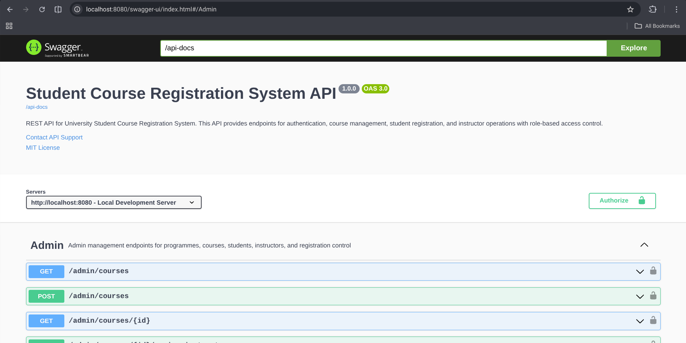

# Student Course Registration System# Student Course Registration System# Student Course Registration System# Student Course Registration System

[](https://www.oracle.com/java/)[](https://www.oracle.com/java/)[](https://www.oracle.com/java/)A comprehensive university course registration system similar to the University of Ghana MIS Web, built with **Java 17** and **Spring Boot 3**.

[](https://spring.io/projects/spring-boot)

[](https://neon.tech/)[](https://spring.io/projects/spring-boot)

[](https://opensource.org/licenses/MIT)

[](https://neon.tech/)[](https://spring.io/projects/spring-boot)

A comprehensive REST API backend for university student course registration, inspired by the University of Ghana MIS Web system. Features JWT authentication, role-based access control, and interactive API documentation.

[](https://opensource.org/licenses/MIT)

---

[](https://neon.tech/)## 🎯 Overview

## 📋 Table of Contents

A comprehensive REST API backend for university student course registration, inspired by the University of Ghana MIS Web system. Features JWT authentication, role-based access control, and interactive API documentation.

- [Features](#-features)

- [Technology Stack](#-technology-stack)[](https://opensource.org/licenses/MIT)

- [Getting Started](#-getting-started)

- [API Documentation](#-api-documentation)## 📋 Table of Contents

- [Security](#-security)

- [Testing](#-testing)This system manages student course registration with three user roles: **ADMIN**, **INSTRUCTOR**, and **STUDENT**. It provides a complete backend REST API following clean architecture principles and best practices.

- [Deployment](#-deployment)

- [Additional Documentation](#-additional-documentation)- [Features](#-features)

---- [Technology Stack](#-technology-stack)A comprehensive REST API backend for university student course registration, inspired by the University of Ghana MIS Web system. This system provides role-based access control for students, instructors, and administrators with JWT authentication.

## ✨ Features- [Getting Started](#-getting-started)

### 👨‍🎓 For Students- [API Documentation](#-api-documentation)## ✨ Features

- Browse courses filtered by programme, level, and semester

- Register for courses during open registration periods- [User Roles](#-user-roles)

- View personal course registrations

- Check course details and credit hours- [Security](#-security)## 📋 Table of Contents

### 👨‍🏫 For Instructors- [Project Structure](#-project-structure)

- View assigned courses

- Access student lists for courses- [Documentation](#-documentation)### 👨‍💼 Admin Features

- Monitor course enrollments

## ✨ Features- [Features](#-features)

### 👨‍💼 For Administrators

- Manage programmes and courses### For Students- [System Architecture](#-system-architecture)- ✅ Create and manage programmes (e.g., BSc Computer Science)

- Create student and instructor accounts

- Assign instructors to courses- 📚 Browse courses filtered by programme, level, and semester

- Control registration periods

- Full system oversight- ✍️ Register for courses during open registration periods- [Technology Stack](#-technology-stack)- ✅ Create courses with programme, level, and semester assignments

### 🔧 System Features- 📋 View personal course registrations

- 🔐 JWT-based authentication

- 🛡️ Role-based access control (RBAC)- 🔍 Check course details and credit hours- [Getting Started](#-getting-started)- ✅ Assign instructors to courses

- 📝 Input validation with Bean Validation

- ⚠️ Global exception handling### For Instructors- [API Documentation](#-api-documentation)- ✅ Create student accounts and assign them to programmes and levels

- 📊 Interactive Swagger/OpenAPI documentation

- 🗄️ PostgreSQL with Neon cloud hosting- 👨‍🏫 View assigned courses

- 🚀 RESTful API design

- 👥 Access student lists for courses- [Database Schema](#-database-schema)- ✅ Open/close registration periods for specific semesters

---

- 📊 Monitor course enrollments

## 🛠️ Technology Stack

- [User Roles & Permissions](#-user-roles--permissions)- ✅ View all registered students per course

| Component | Technology |

|-----------|-----------|### For Administrators

| **Backend Framework** | Spring Boot 3.2.0 |

| **Language** | Java 17 |- 🏫 Manage programmes and courses- [Security](#-security)

| **Security** | Spring Security + JWT |

| **Database** | PostgreSQL (Neon) |- 👨‍🎓 Create student accounts

| **ORM** | Spring Data JPA + Hibernate |

| **Documentation** | Springdoc OpenAPI (Swagger) |- 👨‍🏫 Create instructor accounts and assign to courses- [Project Structure](#-project-structure)### 👨‍🏫 Instructor Features

| **Build Tool** | Maven |

- 🗓️ Control registration periods

---

- 📈 Full system oversight- [Configuration](#-configuration)

## 🚀 Getting Started

### System Features- [Testing](#-testing)- ✅ View all assigned courses

### Prerequisites

- 🔐 JWT-based authentication

- Java 17+

- Maven 3.6+- 🛡️ Role-based access control- [Deployment](#-deployment)- ✅ View list of students registered for each course

- PostgreSQL (or Neon account)

- 📝 Input validation

### Installation

- ⚠️ Global exception handling- [Contributing](#-contributing)

1. **Clone the repository**

   ```bash- 📊 Interactive Swagger/OpenAPI documentation

   git clone https://github.com/kkbaidu/Students-Course-Allocation.git

   cd Students-Course-Allocation- 🗄️ PostgreSQL with Neon cloud hosting- [License](#-license)### 👨‍🎓 Student Features

   ```

## 🛠️ Technology Stack## ✨ Features- ✅ View available courses for their programme, level, and current semester

2. **Configure environment variables**

   | Component | Technology |- ✅ Register for courses (only when registration is open)

   Copy the example file:

   ````bash|-----------|-----------|

   cp .env.example .env

   ```| Backend Framework | Spring Boot 3.2.0 |### Student Features- ✅ View registered courses


   Edit `.env` with your database credentials:| Language | Java 17 |

   ```properties

   DATABASE_URL=jdbc:postgresql://your-host:5432/your-database?sslmode=require| Security | Spring Security + JWT |- 👤 User authentication with JWT tokens- ✅ Prevented from duplicate course registration

   DATABASE_USERNAME=your-username

   DATABASE_PASSWORD=your-password| Database | PostgreSQL (Neon) |

   JWT_SECRET=your-secret-key-min-256-bits

   ```| ORM | Spring Data JPA + Hibernate |- 📚 Browse available courses filtered by programme, level, and semester- ✅ Restricted to courses matching their programme and level

   ````

3. **Build the project**| Documentation | Springdoc OpenAPI (Swagger) |

   ```bash

   mvn clean install| Build Tool | Maven |- ✍️ Register for courses during open registration periods

   ```

## 🚀 Getting Started- 📋 View personal course registrations## 🏗️ Architecture

4. **Run the application**

   ````bash### Prerequisites- 🔍 Check course prerequisites and credit hours

   mvn spring-boot:run

   ```- Java 17+The application follows a **clean layered architecture**:


   Server starts at `http://localhost:8080`- Maven 3.6+
   ````

### Quick Test Credentials- PostgreSQL (or Neon account)### Instructor Features

The application automatically loads sample data:### Installation- 👨‍🏫 View assigned courses```

| Role | Username | Password |1. **Clone the repository**- 👥 Access student lists for assigned courses┌─────────────────────────────────────┐

|------|----------|----------|

| Admin | admin | admin123 | ````bash

| Instructor | dr.mensah | instructor123 |

| Instructor | dr.asante | instructor123 | git clone https://github.com/kkbaidu/Students-Course-Allocation.git- 📊 Monitor course enrollments│ Controller Layer (REST) │

| Student | student1 | student123 |

| Student | student2 | student123 | cd Students-Course-Allocation

--- ```├─────────────────────────────────────┤

## 📚 API Documentation ````

### Interactive Swagger UI2. **Configure environment variables**### Administrator Features│ Service Layer (Business) │

Access the interactive API documentation at: Copy the example file and add your credentials:- 🏫 Create and manage academic programmes (BSc CS, BSc IT, etc.)├─────────────────────────────────────┤

**http://localhost:8080/swagger-ui.html** ```bash

 cp .env.example .env- 📖 Create and manage courses with prerequisites│ Repository Layer (Data Access) │

### Quick API Usage ```

1. **Login to get JWT token:** - 👨‍🎓 Create student accounts with programme assignment├─────────────────────────────────────┤

   `````bash

   curl -X POST http://localhost:8080/auth/login \   Edit `.env` with your database details:

     -H "Content-Type: application/json" \

     -d '{"username":"student1","password":"student123"}'   ````properties- 👨‍🏫 Create instructor accounts and manage profiles│ Domain Layer (Entities) │

   `````

   DATABASE_URL=jdbc:postgresql://your-host:5432/your-database?sslmode=require

2. **Use token in requests:**

   ```bash DATABASE_USERNAME=your-username- 🔗 Assign instructors to courses└─────────────────────────────────────┘

   curl -X GET http://localhost:8080/student/courses \

     -H "Authorization: Bearer YOUR_JWT_TOKEN"   DATABASE_PASSWORD=your-password

   ```

   JWT_SECRET=your-secret-key-min-256-bits- 🗓️ Open and close course registration periods```

3. **In Swagger UI:**

   - Click "Authorize" 🔒 button ````

   - Enter: `Bearer YOUR_JWT_TOKEN`

   - Test endpoints interactively- 📈 Full system oversight

### API Endpoints Overview3. **Build the project**

#### 🔓 Authentication (Public) ````bash### Technology Stack

- `POST /auth/login` - User login

  mvn clean install

#### 🔐 Admin Endpoints

- `POST /admin/programmes` - Create programme ```### System Features

- `POST /admin/courses` - Create course

- `POST /admin/students` - Create student ````

- `POST /admin/instructors` - Create instructor

- `POST /admin/courses/{courseId}/assign-instructor` - Assign instructor4. **Run the application**- 🔐 JWT-based stateless authentication- **Java 17**

- `POST /admin/registration/open` - Open registration

- `POST /admin/registration/close` - Close registration ```bash

- `GET /admin/programmes` - List programmes

- `GET /admin/courses` - List courses mvn spring-boot:run- 🛡️ Role-based access control (RBAC)- **Spring Boot 3.2.0**

- `GET /admin/students` - List students

- `GET /admin/instructors` - List instructors ```

#### 🔐 Instructor Endpoints- 📝 Comprehensive input validation- **Spring Security** with JWT authentication

- `GET /instructor/courses` - Get assigned courses

- `GET /instructor/courses/{courseId}/students` - Get course students Server starts at `http://localhost:8080`

#### 🔐 Student Endpoints- ⚠️ Global exception handling- **Spring Data JPA** with Hibernate

- `GET /student/courses` - Get available courses

- `POST /student/register` - Register for course### Quick Test

- `GET /student/registrations` - Get my registrations

- 📊 Interactive Swagger/OpenAPI documentation- **PostgreSQL** (primary database)

### Permission Matrix

The application loads sample data automatically:

| Feature | Admin | Instructor | Student |

|---------|:-----:|:----------:|:-------:|- 🗄️ PostgreSQL database with Neon cloud hosting- **H2** (testing)

| Create Programme | ✅ | ❌ | ❌ |

| Create Course | ✅ | ❌ | ❌ || Role | Username | Password |

| Create Users | ✅ | ❌ | ❌ |

| Assign Instructors | ✅ | ❌ | ❌ ||------|----------|----------|- 🚀 RESTful API design- **Lombok** (reduce boilerplate)

| Control Registration | ✅ | ❌ | ❌ |

| View Assigned Courses | ✅ | ✅ | ❌ || Admin | admin | admin123 |

| View Course Students | ✅ | ✅ | ❌ |

| Register for Courses | ❌ | ❌ | ✅ || Instructor | dr.mensah | instructor123 |- 📱 CORS-enabled for frontend integration- **Maven** (build tool)

| View My Registrations | ❌ | ❌ | ✅ |

| Student | student1 | student123 |

---

- **Bean Validation** (DTO validation)

## 🔒 Security

## 📚 API Documentation

### Authentication Flow

## 🏗️ System Architecture

```

User Login → JWT Token Generated → Include in Authorization Header → Access Protected Endpoints### Interactive Swagger UI

```

## 📦 Domain Model

### Security Features

Access the interactive API documentation at:

- ✅ Stateless JWT authentication (24-hour expiration)

- ✅ BCrypt password hashing````````

- ✅ Role-based access control (RBAC)

- ✅ Input validation with Jakarta Bean Validation```

- ✅ SQL injection prevention via JPA

- ✅ CORS configurationhttp://localhost:8080/swagger-ui.html┌─────────────────────────────────────────────────────────────┐### Entities

- ✅ Environment variable protection

````

### Protecting Credentials

│                     Client Applications                      │

**⚠️ NEVER commit `.env` file to Git!**


This project uses:

- `.env` file for sensitive data (gitignored)│            (Web, Mobile, Desktop, Postman, etc.)            │- **User**: Base user with authentication credentials and roles

- `.env.example` as a template

- Environment variables referenced in `application.yml`### Using the API


See **[SECURITY_GUIDE.md](SECURITY_GUIDE.md)** for detailed security practices.└─────────────────────────────────────────────────────────────┘- **Student**: Student profile linked to User


---1. **Login to get JWT token:**


## 🗄️ Database Schema   ```bash                              │- **Programme**: Academic programmes (e.g., BSc Computer Science)


### Core Tables   curl -X POST http://localhost:8080/auth/login \


- **users** - Authentication credentials and roles     -H "Content-Type: application/json" \                    ┌─────────▼─────────┐- **Course**: Individual courses with programme, level, and semester

- **students** - Student profiles linked to users

- **instructors** - Instructor profiles linked to users     -d '{"username":"student1","password":"student123"}'

- **programmes** - Academic programmes (BSc CS, BSc IT, etc.)

- **courses** - Course catalog   ```                    │   JWT Auth Layer  │- **CourseAssignment**: Links instructors to courses

- **course_assignments** - Instructor-to-course mappings

- **course_registrations** - Student course enrollments

- **registration_status** - Controls registration periods

2. **Use token in requests:**                    │  (Bearer Token)    │- **CourseRegistration**: Student course enrollments

### Key Relationships

   ```bash

- User → Student (1:1)

- User → Instructor (1:1)   curl -X GET http://localhost:8080/student/courses \                    └─────────┬─────────┘- **RegistrationStatus**: Controls when registration is open/closed

- Student → Programme (N:1)

- Course → Programme (N:1)     -H "Authorization: Bearer YOUR_JWT_TOKEN"

- CourseRegistration → Student + Course (N:1)

- CourseAssignment → Instructor + Course (N:1)   ```                              │


For detailed schema, see **[DATABASE_SCHEMA.md](DATABASE_SCHEMA.md)**


---3. **In Swagger UI:**┌─────────────────────────────▼─────────────────────────────┐### Enums


## 🧪 Testing   - Click "Authorize" 🔒 button


### With Swagger UI   - Enter: `Bearer YOUR_JWT_TOKEN`│                      REST API Layer                        │

1. Start application: `mvn spring-boot:run`

2. Open: http://localhost:8080/swagger-ui.html   - Test endpoints interactively

3. Login with test credentials

4. Authorize with JWT token│  ┌──────────┐ ┌──────────┐ ┌──────────┐ ┌──────────┐    │- **Role**: ADMIN, INSTRUCTOR, STUDENT

5. Test endpoints interactively

### API Endpoints Overview

### With cURL

```bash│  │   Auth   │ │  Admin   │ │Instructor│ │ Student  │    │- **Level**: LEVEL100, LEVEL200, LEVEL300, LEVEL400

# Login and save token

TOKEN=$(curl -X POST http://localhost:8080/auth/login \#### Authentication (Public)

  -H "Content-Type: application/json" \

  -d '{"username":"admin","password":"admin123"}' | jq -r '.token')- `POST /auth/login` - User login│  │Controller│ │Controller│ │Controller│ │Controller│    │- **Semester**: FIRST, SECOND


# Create a programme

curl -X POST http://localhost:8080/admin/programmes \

  -H "Authorization: Bearer $TOKEN" \#### Admin Endpoints│  └──────────┘ └──────────┘ └──────────┘ └──────────┘    │

  -H "Content-Type: application/json" \

  -d '{"code":"BSC-MATH","name":"BSc Mathematics","description":"Mathematics programme"}'- `POST /admin/programmes` - Create programme


# Get available courses (as student)- `POST /admin/courses` - Create course└────────────────────────────┬──────────────────────────────┘## 🔐 Security

curl -X GET "http://localhost:8080/student/courses?level=LEVEL_100&semester=FIRST" \

  -H "Authorization: Bearer $TOKEN"- `POST /admin/students` - Create student

````

- `POST /admin/instructors` - Create instructor │

For complete testing examples, see **[API_TESTING.md](API_TESTING.md)**

- `POST /admin/courses/{courseId}/assign-instructor` - Assign instructor

---

- `POST /admin/registration/open` - Open registration┌─────────────────────────────▼─────────────────────────────┐- JWT-based authentication

## 🚀 Deployment

- `GET /admin/programmes` - List programmes

### Local Deployment

```bash- `GET /admin/courses` - List courses│ Service Layer │- Role-based access control (RBAC)

# Build JAR

mvn clean package- `GET /admin/students` - List students

# Run JAR- `GET /admin/instructors` - List instructors│ ┌──────────┐ ┌──────────┐ ┌──────────┐ ┌──────────┐ │- Password encryption using BCrypt

java -jar target/student-course-allocation-1.0.0.jar

````


### Docker Deployment#### Instructor Endpoints│  │   Auth   │ │  Admin   │ │Instructor│ │ Student  │    │- Stateless session management

```dockerfile

FROM openjdk:17-jdk-slim- `GET /instructor/courses` - Get assigned courses

WORKDIR /app

COPY target/*.jar app.jar- `GET /instructor/courses/{courseId}/students` - Get course students│  │ Service  │ │ Service  │ │ Service  │ │ Service  │    │- Secured endpoints per role

EXPOSE 8080

ENTRYPOINT ["java", "-jar", "app.jar"]

````

#### Student Endpoints│ └──────────┘ └──────────┘ └──────────┘ └──────────┘ │

````bash

docker build -t student-registration .- `GET /student/courses` - Get available courses

docker run -p 8080:8080 --env-file .env student-registration

```- `POST /student/register` - Register for course└────────────────────────────┬──────────────────────────────┘## 🚀 Getting Started


### Cloud Platforms- `GET /student/registrations` - Get my registrations

- **Heroku** - Git-based deployment

- **Railway** - GitHub auto-deployment                              │

- **Render** - Free tier with PostgreSQL

- **AWS/GCP** - Enterprise deployment## 👥 User Roles


See **[DEPLOYMENT.md](DEPLOYMENT.md)** for detailed deployment instructions.┌─────────────────────────────▼─────────────────────────────┐### Prerequisites


---### Permission Matrix


## 📁 Project Structure│                    Repository Layer                        │


```| Feature | Admin | Instructor | Student |

src/main/java/com/example/registration/

├── config/              # Configuration classes|---------|-------|------------|---------|│  (Spring Data JPA - Hibernate ORM)                        │- Java 17 or higher

├── controller/          # REST API endpoints

├── domain/              # JPA entities| Create Programme | ✅ | ❌ | ❌ |

├── dto/                 # Data Transfer Objects

├── exception/           # Exception handling| Create Course | ✅ | ❌ | ❌ |└────────────────────────────┬──────────────────────────────┘- Maven 3.6+

├── repository/          # Data access layer

├── security/            # Security & JWT config| Create Users | ✅ | ❌ | ❌ |

└── service/             # Business logic

    └── impl/            # Service implementations| Assign Instructors | ✅ | ❌ | ❌ |                              │- PostgreSQL 12+ (or use H2 for development)

````

| Control Registration | ✅ | ❌ | ❌ |

---

| View Assigned Courses | ✅ | ✅ | ❌ |┌─────────────────────────────▼─────────────────────────────┐

## ⚙️ Configuration

| View Course Students | ✅ | ✅ (own) | ❌ |

### Application Properties

| Register for Courses | ❌ | ❌ | ✅ |│ PostgreSQL Database (Neon) │### Database Setup

Located in `src/main/resources/application.yml`:

| View Registrations | ❌ | ❌ | ✅ |

```yaml

spring:│  Tables: users, students, instructors, programmes,        │

  datasource:

    url: ${DATABASE_URL}## 🔒 Security

    username: ${DATABASE_USERNAME}

    password: ${DATABASE_PASSWORD}│  courses, course_assignments, course_registrations        │1. Create a PostgreSQL database:


jwt:### Authentication Flow

  secret: ${JWT_SECRET}

  expiration: 86400000  # 24 hours└───────────────────────────────────────────────────────────┘

```

```````

### Environment Variables

User Login → JWT Token → Authorization Header → Protected Endpoints``````sql

Required in `.env` file:

- `DATABASE_URL` - PostgreSQL connection string```

- `DATABASE_USERNAME` - Database username

- `DATABASE_PASSWORD` - Database passwordCREATE DATABASE course_registration_db;

- `JWT_SECRET` - Secret key for JWT signing (256+ bits)

### Security Features

---

## 🛠️ Technology Stack```

## 📚 Additional Documentation

- ✅ Stateless JWT authentication

Comprehensive guides are available:

- ✅ BCrypt password hashing

- **[QUICKSTART.md](QUICKSTART.md)** - Quick start guide

- **[API_TESTING.md](API_TESTING.md)** - API testing examples- ✅ Role-based access control (RBAC)

- **[SWAGGER_GUIDE.md](SWAGGER_GUIDE.md)** - Using Swagger UI

- **[DATABASE_SCHEMA.md](DATABASE_SCHEMA.md)** - Database documentation- ✅ Input validation| Layer | Technology |2. Update `src/main/resources/application.yml` with your database credentials:

- **[DEPLOYMENT.md](DEPLOYMENT.md)** - Deployment guide

- **[NEON_SETUP.md](NEON_SETUP.md)** - Neon database setup- ✅ SQL injection prevention

- **[SECURITY_GUIDE.md](SECURITY_GUIDE.md)** - Security best practices

- ✅ 24-hour token expiration|-------|-----------|

---

- ✅ Environment variable protection

## 🤝 Contributing

| **Backend Framework** | Spring Boot 3.2.0 |```yaml

Contributions are welcome!

### Protecting Credentials

1. Fork the repository

2. Create feature branch: `git checkout -b feature/amazing-feature`| **Language** | Java 17 |spring:

3. Commit changes: `git commit -m 'Add amazing feature'`

4. Push to branch: `git push origin feature/amazing-feature`**⚠️ NEVER commit `.env` file to Git!**

5. Open a Pull Request

| **Security** | Spring Security + JWT (jsonwebtoken 0.12.3) |  datasource:

---

This project uses:

## 📝 License

- `.env` file for sensitive data (gitignored)| **ORM** | Spring Data JPA + Hibernate 6.3.1 |    url: jdbc:postgresql://localhost:5432/course_registration_db

This project is licensed under the MIT License.

- `.env.example` as template

---

- Environment variables in `application.yml`| **Database** | PostgreSQL 15 (Neon Serverless) |    username: your_username

## 📧 Contact


- **Developer:** Kingsley Korankye Baidu

- **Email:** kingsleybaidu99@gmail.comSee [SECURITY_GUIDE.md](SECURITY_GUIDE.md) for details.| **Validation** | Jakarta Validation (Bean Validation 3.0) |    password: your_password

- **GitHub:** [@kkbaidu](https://github.com/kkbaidu)

- **Repository:** [Students-Course-Allocation](https://github.com/kkbaidu/Students-Course-Allocation)

- **Issues:** [GitHub Issues](https://github.com/kkbaidu/Students-Course-Allocation/issues)

## 📁 Project Structure| **Documentation** | Springdoc OpenAPI 3.0 (Swagger UI 2.2.0) |```

---


## 🙏 Acknowledgments

```| **Build Tool** | Maven 3.8.7 |

- Inspired by University of Ghana MIS Web System

- Built with Spring Boot and Spring Securitysrc/main/java/com/example/registration/

- Database hosted on Neon PostgreSQL

- API documentation powered by Springdoc OpenAPI├── config/              # Configuration classes| **Utilities** | Lombok |### Build and Run


---├── controller/          # REST API endpoints


<div align="center">├── domain/              # JPA entities


**⭐ Star this repo if you find it helpful!**├── dto/                 # Data Transfer Objects


Made with ❤️ for University Course Registration├── exception/           # Exception handling## 🚀 Getting Started```bash


</div>├── repository/          # Data access layer


├── security/            # Security & JWT config# Clone the repository

└── service/             # Business logic

    └── impl/            # Service implementations### Prerequisitescd student-course-allocation

```````

### Key Components

- **Java 17** or higher# Build the project

- **Domain Entities**: User, Student, Instructor, Programme, Course, CourseRegistration

- **Security**: JWT token provider, authentication filter, security config- **Maven 3.6+**mvn clean install

- **Controllers**: Auth, Admin, Instructor, Student

- **Services**: Business logic for each role- **PostgreSQL** (or Neon account for cloud database)

- **Repositories**: Spring Data JPA repositories

- **Git**# Run the application

## 📖 Documentation

mvn spring-boot:run

Comprehensive guides are available:

### Installation```

- **[QUICKSTART.md](QUICKSTART.md)** - Get started quickly

- **[API_TESTING.md](API_TESTING.md)** - API testing guide

- **[SWAGGER_GUIDE.md](SWAGGER_GUIDE.md)** - Swagger documentation

- **[DATABASE_SCHEMA.md](DATABASE_SCHEMA.md)** - Database structure1. **Clone the repository**The application will start on `http://localhost:8080`

- **[DEPLOYMENT.md](DEPLOYMENT.md)** - Deployment guide

- **[NEON_SETUP.md](NEON_SETUP.md)** - Neon database setup ```bash

- **[SECURITY_GUIDE.md](SECURITY_GUIDE.md)** - Security best practices

  git clone https://github.com/yourusername/student-course-allocation.git## 📋 Sample Data

## 🧪 Testing

cd student-course-allocation

### With Swagger UI

1. Start application: `mvn spring-boot:run` ```The application automatically loads sample data on first run:

2. Open: http://localhost:8080/swagger-ui.html

3. Login with test credentials

4. Authorize with JWT token

5. Test endpoints interactively2. **Set up environment variables**### Login Credentials

### With cURL

````````bash

# Login   Create a `.env` file in the project root (or copy from `.env.example`):| Role       | Username  | Password      |

TOKEN=$(curl -X POST http://localhost:8080/auth/login \

  -H "Content-Type: application/json" \   ```bash| ---------- | --------- | ------------- |

  -d '{"username":"admin","password":"admin123"}' | jq -r '.token')

   cp .env.example .env| Admin      | admin     | admin123      |

# Create Programme

curl -X POST http://localhost:8080/admin/programmes \   ```| Instructor | dr.mensah | instructor123 |

  -H "Authorization: Bearer $TOKEN" \

  -H "Content-Type: application/json" \   | Instructor | dr.asante | instructor123 |

  -d '{"code":"BSC-MATH","name":"BSc Mathematics","description":"Mathematics programme"}'

```   Edit `.env` with your database credentials:| Student    | student1  | student123    |


## 🚀 Deployment   ```properties| Student    | student2  | student123    |


### Build for Production   DATABASE_URL=jdbc:postgresql://your-host:5432/your-database?sslmode=require

```bash

mvn clean package   DATABASE_USERNAME=your-username### Pre-loaded Data

java -jar target/student-course-allocation-1.0.0.jar

```   DATABASE_PASSWORD=your-password


### Docker Deployment   JWT_SECRET=your-secret-key-min-256-bits- **Programmes**: BSc Computer Science, BSc Information Technology

```dockerfile

FROM openjdk:17-jdk-slim   ```- **Courses**: DCIT201, DCIT203, DCIT205, DCIT207

COPY target/*.jar app.jar

EXPOSE 8080- **Registration Status**: Open for First Semester 2024/2025

ENTRYPOINT ["java", "-jar", "app.jar"]

```3. **Build the project**


### Cloud Platforms   ```bash## 🔌 API Endpoints

- **Heroku** - Git-based deployment

- **Railway** - GitHub auto-deployment   mvn clean install

- **Render** - Free tier with PostgreSQL

- **AWS/GCP** - Enterprise deployment   ```### Authentication


See [DEPLOYMENT.md](DEPLOYMENT.md) for detailed instructions.


## 🗄️ Database Schema4. **Run the application**#### Login


### Core Tables   ```bash

- **users** - Authentication & roles

- **students** - Student profiles   mvn spring-boot:run```http

- **instructors** - Instructor profiles

- **programmes** - Academic programmes   ```POST /auth/login

- **courses** - Course catalog

- **course_assignments** - Instructor assignmentsContent-Type: application/json

- **course_registrations** - Student enrollments

- **registration_status** - Registration control   The application will start on `http://localhost:8080`


### Key Relationships{

- User → Student (1:1)

- User → Instructor (1:1)5. **Access Swagger UI**  "username": "student1",

- Student → Programme (N:1)

- Course → Programme (N:1)     "password": "student123"

- CourseRegistration → Student + Course (N:1)

- CourseAssignment → Instructor + Course (N:1)   Open your browser and navigate to:}


## ⚙️ Configuration```````


### Application Propertieshttp://localhost:8080/swagger-ui.htmlResponse:

Located in `src/main/resources/application.yml`:

````{

```yaml

spring:"token": "eyJhbGc...",

  datasource:

    url: ${DATABASE_URL}### Quick Start with Sample Data  "type": "Bearer",

    username: ${DATABASE_USERNAME}

    password: ${DATABASE_PASSWORD}"username": "student1",


jwt:The application automatically loads sample data on first run:  "role": "STUDENT",

  secret: ${JWT_SECRET}

  expiration: 86400000  # 24 hours"message": "Login successful"

````````

| Role | Username | Password |}

### Environment Variables

Required variables in `.env`:|------|----------|----------|```

- `DATABASE_URL` - PostgreSQL connection string

- `DATABASE_USERNAME` - Database username| Admin | admin | admin123 |

- `DATABASE_PASSWORD` - Database password

- `JWT_SECRET` - Secret key for JWT (256+ bits)| Instructor | dr.mensah | instructor123 |### Admin Endpoints

## 🤝 Contributing| Instructor | dr.asante | instructor123 |

1. Fork the repository| Student | student1 | student123 |All admin endpoints require `ROLE_ADMIN` and a valid JWT token in the `Authorization` header:

2. Create feature branch: `git checkout -b feature/amazing-feature`

3. Commit changes: `git commit -m 'Add amazing feature'`| Student | student2 | student123 |

4. Push to branch: `git push origin feature/amazing-feature`

5. Open Pull Request````

## 📝 License## 📚 API DocumentationAuthorization: Bearer <token>

This project is licensed under the MIT License.````

## 📧 Contact### Interactive Documentation (Swagger UI)

- **Repository**: [Students-Course-Allocation](https://github.com/kkbaidu/Students-Course-Allocation)#### Programme Management

- **Issues**: [GitHub Issues](https://github.com/kkbaidu/Students-Course-Allocation/issues)

The best way to explore and test the API is through the interactive Swagger UI:

## 🙏 Acknowledgments

````http

- Inspired by University of Ghana MIS Web System

- Built with Spring Boot ecosystem# Create Programme

- Database hosted on Neon PostgreSQL

- Documentation powered by Springdoc OpenAPIPOST /admin/programmes


---**Access Swagger UI:** http://localhost:8080/swagger-ui.html{


<div align="center">  "code": "BSC-CS",


**⭐ Star this repo if you find it helpful!**### API Endpoints Overview  "name": "BSc Computer Science",


Made with ❤️ using Spring Boot  "description": "Bachelor of Science in Computer Science",


</div>#### 🔓 Authentication Endpoints (Public)  "active": true


```http}

POST /auth/login - User login (returns JWT token)

```# Get All Programmes

GET /admin/programmes

#### 🔐 Admin Endpoints (Requires ADMIN role)

```http# Get Programme by ID

POST   /admin/programmes                        - Create programmeGET /admin/programmes/{id}

GET    /admin/programmes                        - List all programmes```

POST   /admin/courses                           - Create course

GET    /admin/courses                           - List all courses#### Course Management

POST   /admin/students                          - Create student account

GET    /admin/students                          - List all students```http

POST   /admin/instructors                       - Create instructor account# Create Course

GET    /admin/instructors                       - List all instructorsPOST /admin/courses

POST   /admin/courses/{courseId}/assign-instructor - Assign instructor{

POST   /admin/registration/open                 - Open registration  "courseCode": "DCIT201",

POST   /admin/registration/close                - Close registration  "courseName": "Programming Fundamentals",

```  "description": "Introduction to programming",

  "creditHours": 3,

#### 🔐 Instructor Endpoints (Requires INSTRUCTOR role)  "programmeId": 1,

```http  "level": "LEVEL200",

GET /instructor/courses                    - Get my assigned courses  "semester": "FIRST",

GET /instructor/courses/{courseId}/students - Get students in my course  "active": true

```}


#### 🔐 Student Endpoints (Requires STUDENT role)# Get All Courses

```httpGET /admin/courses

GET  /student/courses       - Get available courses for my programme

POST /student/register      - Register for a course# Get Course by ID

GET  /student/registrations - Get my course registrationsGET /admin/courses/{id}

````

### Using the API with JWT#### Instructor Assignment

1. **Login to get JWT token:**```http

   ````bash# Assign Instructor to Course

   curl -X POST http://localhost:8080/auth/login \POST /admin/courses/{courseId}/assign-instructor

     -H "Content-Type: application/json" \{

     -d '{"username":"student1","password":"student123"}'  "instructorId": 2

   ```}
   ````

````

2. **Use token in subsequent requests:**

   ```bash#### Student Management

   curl -X GET http://localhost:8080/student/courses \

     -H "Authorization: Bearer YOUR_JWT_TOKEN"```http

   ```# Create Student

POST /admin/students

3. **In Swagger UI:**{

   - Click the "Authorize" 🔒 button  "username": "student3",

   - Enter: `Bearer YOUR_JWT_TOKEN`  "password": "student123",

   - Click "Authorize" and "Close"  "firstName": "Kofi",

   - Now all requests will include your token  "lastName": "Owusu",

  "email": "kofi.owusu@st.ug.edu.gh",

For detailed API usage examples, see [API_TESTING.md](API_TESTING.md)  "studentId": "10956791",

  "programmeId": 1,

## 🗄️ Database Schema  "level": "LEVEL200",

  "yearOfAdmission": 2023

### Entity Relationship Diagram}


```# Get All Students

┌─────────────┐       ┌──────────────┐       ┌─────────────┐GET /admin/students

│    User     │       │   Student    │       │  Programme  │```

├─────────────┤       ├──────────────┤       ├─────────────┤

│ id (PK)     │───────│ id (PK)      │       │ id (PK)     │#### Registration Management

│ username    │  1:1  │ user_id (FK) │───────│ code        │

│ password    │       │ student_id   │  N:1  │ name        │```http

│ email       │       │ programme_id │       │ description │# Open Registration

│ role        │       │ level        │       │ active      │POST /admin/registration/open

│ enabled     │       │ year         │       └─────────────┘{

└─────────────┘       └──────────────┘              │  "semester": "FIRST",

       │                      │                      │  "academicYear": 2024

       │                      │                      │ N:1}

       │ N:1                  │ N:1                  │

       │                      │                      │# Close Registration

       │              ┌───────▼────────┐       ┌────▼──────┐POST /admin/registration/close?semester=FIRST&academicYear=2024

       │              │Course          │       │  Course   │```

       │              │Registration    │       ├───────────┤

       │              ├────────────────┤       │ id (PK)   │#### Reports

       │              │ id (PK)        │───────│ code      │

       │              │ student_id (FK)│  N:1  │ name      │```http

       │              │ course_id (FK) │       │ credits   │# Get Students for a Course

       │              │ semester       │       │ level     │GET /admin/courses/{courseId}/students

       │              │ academic_year  │       │ semester  │```

       │              │ reg_date       │       │ prog_id   │

       │              └────────────────┘       └───────────┘### Instructor Endpoints

       │                                              │

       │ N:1                                          │ N:1Requires `ROLE_INSTRUCTOR`:

       │                                              │

       │              ┌────────────────┐              │```http

       └──────────────│Course          │──────────────┘# Get Assigned Courses

                      │Assignment      │GET /instructor/courses

                      ├────────────────┤

                      │ id (PK)        │# Get Students for a Course

                      │ course_id (FK) │GET /instructor/courses/{courseId}/students

                      │ instructor_id  │```

                      │ assigned_date  │

                      └────────────────┘### Student Endpoints

                              │

                              │ N:1Requires `ROLE_STUDENT`:

                              │

                      ┌───────▼────────┐```http

                      │  Instructor    │# Get Available Courses

                      ├────────────────┤GET /student/courses/available

                      │ id (PK)        │

                      │ user_id (FK)   │# Register for Course

                      │ staff_id       │POST /student/courses/register

                      │ department     │{

                      │ office         │  "courseId": 1

                      │ phone          │}

                      └────────────────┘

```# Get Registered Courses

GET /student/courses/registered

### Key Tables```


- **users** - Authentication credentials and roles## 🧪 Testing with cURL

- **students** - Student profiles linked to users

- **instructors** - Instructor profiles linked to users### 1. Login as Student

- **programmes** - Academic programmes (BSc CS, BSc IT, etc.)

- **courses** - Course catalog with prerequisites```bash

- **course_assignments** - Instructor-to-course mappingscurl -X POST http://localhost:8080/auth/login \

- **course_registrations** - Student course enrollments  -H "Content-Type: application/json" \

- **registration_status** - Controls when registration is open/closed  -d '{"username":"student1","password":"student123"}'

````

For detailed schema documentation, see [DATABASE_SCHEMA.md](DATABASE_SCHEMA.md)

### 2. Get Available Courses

## 👥 User Roles & Permissions

```bash

### Role Hierarchycurl -X GET http://localhost:8080/student/courses/available \

  -H "Authorization: Bearer <your_token>"

```

ADMIN (Full System Access)

│### 3. Register for Course

├── Create/Manage Programmes

├── Create/Manage Courses```bash

├── Create Student Accountscurl -X POST http://localhost:8080/student/courses/register \

├── Create Instructor Accounts -H "Content-Type: application/json" \

├── Assign Instructors to Courses -H "Authorization: Bearer <your_token>" \

└── Control Registration Periods -d '{"courseId":1}'

````

INSTRUCTOR (Course Management)

  │### 4. View Registered Courses

  ├── View Assigned Courses

  └── View Students in Courses```bash

curl -X GET http://localhost:8080/student/courses/registered \

STUDENT (Course Registration)  -H "Authorization: Bearer <your_token>"

  │```

  ├── View Available Courses

  ├── Register for Courses## 🛡️ Error Handling

  └── View My Registrations

```The API returns standardized error responses:


### Permission Matrix```json

{

| Feature | Admin | Instructor | Student |  "status": 404,

|---------|-------|------------|---------|  "message": "Course not found with id: '999'",

| Login | ✅ | ✅ | ✅ |  "timestamp": "2024-11-08T10:30:00"

| Create Programme | ✅ | ❌ | ❌ |}

| Create Course | ✅ | ❌ | ❌ |```

| Create Student | ✅ | ❌ | ❌ |

| Create Instructor | ✅ | ❌ | ❌ |### Common HTTP Status Codes

| Assign Instructor | ✅ | ❌ | ❌ |

| Open/Close Registration | ✅ | ❌ | ❌ |- `200 OK`: Successful request

| View Assigned Courses | ✅ | ✅ | ❌ |- `201 Created`: Resource created successfully

| View Course Students | ✅ | ✅ (own courses) | ❌ |- `400 Bad Request`: Validation error

| Browse Courses | ✅ | ✅ | ✅ |- `401 Unauthorized`: Missing or invalid authentication

| Register for Courses | ❌ | ❌ | ✅ |- `403 Forbidden`: Insufficient permissions or registration closed

| View My Registrations | ❌ | ❌ | ✅ |- `404 Not Found`: Resource not found

- `409 Conflict`: Duplicate resource (e.g., already registered)

## 🔒 Security- `500 Internal Server Error`: Server error


### Authentication Flow## 📁 Project Structure


1. **User Login** → POST `/auth/login` with username/password```

2. **Server Validates** → Checks credentials against databasesrc/main/java/com/example/registration/

3. **JWT Generation** → Creates signed token with user details├── config/

4. **Client Storage** → Client stores token (localStorage, cookies)│   └── SampleDataLoader.java          # Sample data initialization

5. **Authenticated Requests** → Include token in `Authorization: Bearer {token}` header├── controller/

6. **Token Validation** → Server validates token on each request│   ├── AdminController.java           # Admin REST endpoints

7. **Access Control** → Checks user role for endpoint authorization│   ├── AuthController.java            # Authentication endpoints

│   ├── InstructorController.java      # Instructor REST endpoints

### Security Features│   └── StudentController.java         # Student REST endpoints

├── domain/

- ✅ **Stateless JWT Authentication** - No server-side sessions│   ├── Course.java                    # Course entity

- ✅ **BCrypt Password Hashing** - Secure password storage│   ├── CourseAssignment.java          # Instructor-Course mapping

- ✅ **Role-Based Access Control** - Fine-grained permissions│   ├── CourseRegistration.java        # Student-Course enrollment

- ✅ **CSRF Protection** - Disabled for stateless API│   ├── Level.java                     # Level enum

- ✅ **Input Validation** - Jakarta Bean Validation│   ├── Programme.java                 # Programme entity

- ✅ **SQL Injection Prevention** - Parameterized queries (JPA)│   ├── RegistrationStatus.java        # Registration control

- ✅ **HTTPS Ready** - SSL/TLS support│   ├── Role.java                      # Role enum

- ✅ **Token Expiration** - 24-hour token lifetime│   ├── Semester.java                  # Semester enum

- ✅ **CORS Configuration** - Configurable cross-origin policies│   ├── Student.java                   # Student entity

│   └── User.java                      # User entity

### Environment Variable Security├── dto/

│   ├── AssignInstructorDto.java       # Instructor assignment DTO

**⚠️ NEVER commit sensitive credentials to Git!**│   ├── AuthRequest.java               # Login request DTO

│   ├── AuthResponse.java              # Login response DTO

This project uses environment variables to keep credentials secure:│   ├── CourseDto.java                 # Course DTO

│   ├── CourseRegistrationDto.java     # Registration DTO

1. **Database credentials** are stored in `.env` (gitignored)│   ├── CreateStudentDto.java          # Student creation DTO

2. **JWT secret key** is stored in environment variables│   ├── ProgrammeDto.java              # Programme DTO

3. **Sample `.env.example`** provides template without real credentials│   ├── RegistrationStatusDto.java     # Registration status DTO

4. **application.yml** references environment variables using `${VARIABLE_NAME}` syntax│   ├── StudentCourseRegisterDto.java  # Course registration DTO

│   └── StudentDto.java                # Student DTO

## 📁 Project Structure├── exception/

│   ├── DuplicateResourceException.java

```│   ├── GlobalExceptionHandler.java    # Global error handler

student-course-allocation/│   ├── RegistrationClosedException.java

├── src/│   ├── ResourceNotFoundException.java

│   ├── main/│   └── UnauthorizedException.java

│   │   ├── java/com/example/registration/├── repository/

│   │   │   ├── config/              # Configuration classes│   ├── CourseAssignmentRepository.java

│   │   │   │   ├── OpenApiConfig.java       # Swagger configuration│   ├── CourseRegistrationRepository.java

│   │   │   │   └── SampleDataLoader.java    # Sample data loader│   ├── CourseRepository.java

│   │   │   ├── controller/          # REST API endpoints│   ├── ProgrammeRepository.java

│   │   │   │   ├── AdminController.java│   ├── RegistrationStatusRepository.java

│   │   │   │   ├── AuthController.java│   ├── StudentRepository.java

│   │   │   │   ├── InstructorController.java│   └── UserRepository.java

│   │   │   │   └── StudentController.java├── security/

│   │   │   ├── domain/              # JPA entities│   ├── JwtAuthenticationFilter.java   # JWT filter

│   │   │   │   ├── Course.java│   ├── JwtTokenProvider.java          # JWT token utilities

│   │   │   │   ├── CourseAssignment.java│   └── SecurityConfig.java            # Security configuration

│   │   │   │   ├── CourseRegistration.java├── service/

│   │   │   │   ├── Instructor.java│   ├── AdminService.java              # Admin service interface

│   │   │   │   ├── Level.java (enum)│   ├── AuthService.java               # Auth service interface

│   │   │   │   ├── Programme.java│   ├── InstructorService.java         # Instructor service interface

│   │   │   │   ├── RegistrationStatus.java│   ├── StudentService.java            # Student service interface

│   │   │   │   ├── Role.java (enum)│   └── impl/

│   │   │   │   ├── Semester.java (enum)│       ├── AdminServiceImpl.java

│   │   │   │   ├── Student.java│       ├── AuthServiceImpl.java

│   │   │   │   └── User.java│       ├── CustomUserDetailsService.java

│   │   │   ├── dto/                 # Data Transfer Objects│       ├── InstructorServiceImpl.java

│   │   │   │   ├── AssignInstructorDto.java│       └── StudentServiceImpl.java

│   │   │   │   ├── AuthRequest.java└── RegistrationApplication.java       # Main application class

│   │   │   │   ├── AuthResponse.java```

│   │   │   │   ├── CourseDto.java

│   │   │   │   ├── CreateInstructorDto.java## 🎓 Business Rules

│   │   │   │   ├── CreateStudentDto.java

│   │   │   │   ├── InstructorDto.java1. **Registration Period Control**: Students can only register when admin has opened registration for the current semester

│   │   │   │   ├── ProgrammeDto.java2. **Course Eligibility**: Students can only see and register for courses matching their:

│   │   │   │   └── StudentCourseRegisterDto.java   - Programme

│   │   │   ├── exception/           # Exception handling   - Level

│   │   │   │   ├── GlobalExceptionHandler.java   - Current semester

│   │   │   │   └── ResourceNotFoundException.java3. **No Duplicates**: Students cannot register for the same course twice

│   │   │   ├── repository/          # Data access layer4. **Instructor Access**: Instructors can only view students for courses they're assigned to

│   │   │   │   ├── CourseAssignmentRepository.java5. **Data Integrity**: Username, email, student ID, programme code, and course code must be unique

│   │   │   │   ├── CourseRegistrationRepository.java

│   │   │   │   ├── CourseRepository.java## 🔮 Future Enhancements

│   │   │   │   ├── InstructorRepository.java

│   │   │   │   ├── ProgrammeRepository.java- [ ] Course prerequisites validation

│   │   │   │   ├── RegistrationStatusRepository.java- [ ] Maximum credit hours per semester limit

│   │   │   │   ├── StudentRepository.java- [ ] Course withdrawal/drop functionality

│   │   │   │   └── UserRepository.java- [ ] Grade submission by instructors

│   │   │   ├── security/            # Security configuration- [ ] Grade viewing by students

│   │   │   │   ├── JwtAuthenticationFilter.java- [ ] Audit logs for admin actions

│   │   │   │   ├── JwtTokenProvider.java- [ ] Email notifications

│   │   │   │   └── SecurityConfig.java- [ ] Course capacity limits

│   │   │   ├── service/             # Business logic- [ ] Waitlist functionality

│   │   │   │   ├── AdminService.java- [ ] Academic calendar integration

│   │   │   │   ├── AuthService.java- [ ] Transcript generation

│   │   │   │   ├── InstructorService.java

│   │   │   │   ├── StudentService.java## 📝 API Documentation

│   │   │   │   └── impl/            # Service implementations

│   │   │   │       ├── AdminServiceImpl.javaFor detailed API documentation, you can integrate **Swagger/OpenAPI**:

│   │   │   │       ├── AuthServiceImpl.java

│   │   │   │       ├── CustomUserDetailsService.javaAdd to `pom.xml`:

│   │   │   │       ├── InstructorServiceImpl.java

│   │   │   │       └── StudentServiceImpl.java```xml

│   │   │   └── RegistrationApplication.java  # Main application<dependency>

│   │   └── resources/    <groupId>org.springdoc</groupId>

│   │       └── application.yml      # Application configuration    <artifactId>springdoc-openapi-starter-webmvc-ui</artifactId>

│   └── test/                        # Test classes    <version>2.2.0</version>

├── img/                             # Documentation images</dependency>

│   └── swagger-interface-screenshot.png```

├── .env                             # Environment variables (gitignored)

├── .env.example                     # Environment variables templateAccess Swagger UI at: `http://localhost:8080/swagger-ui.html`

├── .gitignore                       # Git ignore file

├── API_TESTING.md                   # API testing guide## 🤝 Contributing

├── DATABASE_SCHEMA.md               # Database documentation

├── DEPLOYMENT.md                    # Deployment guide1. Fork the repository

├── NEON_SETUP.md                    # Neon database setup2. Create a feature branch: `git checkout -b feature/new-feature`

├── QUICKSTART.md                    # Quick start guide3. Commit your changes: `git commit -am 'Add new feature'`

├── SWAGGER_GUIDE.md                 # Swagger usage guide4. Push to the branch: `git push origin feature/new-feature`

├── pom.xml                          # Maven configuration5. Submit a pull request

└── README.md                        # This file

```## 📄 License


## ⚙️ ConfigurationThis project is open-source and available under the MIT License.


### Application Configuration (application.yml)## 👨‍💻 Author


```yamlBuilt with ❤️ using Spring Boot and clean architecture principles.

spring:

  datasource:## 📞 Support

    url: ${DATABASE_URL}

    username: ${DATABASE_USERNAME}For issues or questions, please open an issue on the GitHub repository.

    password: ${DATABASE_PASSWORD}

    driver-class-name: org.postgresql.Driver---


  jpa:**Happy Coding! 🚀**

    hibernate:
      ddl-auto: update  # Creates/updates schema automatically
    show-sql: true      # Logs SQL queries (disable in production)

jwt:
  secret: ${JWT_SECRET:default-secret-key-change-in-production}
  expiration: 86400000  # 24 hours

springdoc:
  swagger-ui:
    path: /swagger-ui.html
    enabled: true
````

### Environment Variables

Create a `.env` file with:

```properties
DATABASE_URL=jdbc:postgresql://your-host:5432/your-database?sslmode=require
DATABASE_USERNAME=your-username
DATABASE_PASSWORD=your-password
JWT_SECRET=your-256-bit-secret-key
```

**Important:** The `.env` file is gitignored and will NOT be committed to your repository.

### Database Configuration

#### Local PostgreSQL

```properties
DATABASE_URL=jdbc:postgresql://localhost:5432/course_registration
DATABASE_USERNAME=postgres
DATABASE_PASSWORD=yourpassword
```

#### Neon Cloud Database

```properties
DATABASE_URL=jdbc:postgresql://ep-xxx.aws.neon.tech/neondb?sslmode=require
DATABASE_USERNAME=neondb_owner
DATABASE_PASSWORD=your-neon-password
```

For detailed Neon setup instructions, see [NEON_SETUP.md](NEON_SETUP.md)

## 🧪 Testing

### Testing with Swagger UI

1. Start the application: `mvn spring-boot:run`
2. Open http://localhost:8080/swagger-ui.html
3. Login with test credentials
4. Authorize with JWT token
5. Test endpoints interactively

### Testing with cURL

```bash
# Login
TOKEN=$(curl -X POST http://localhost:8080/auth/login \
  -H "Content-Type: application/json" \
  -d '{"username":"admin","password":"admin123"}' \
  | jq -r '.token')

# Create Programme (Admin)
curl -X POST http://localhost:8080/admin/programmes \
  -H "Authorization: Bearer $TOKEN" \
  -H "Content-Type: application/json" \
  -d '{
    "code": "BSC-MATH",
    "name": "BSc Mathematics",
    "description": "Bachelor of Science in Mathematics"
  }'

# Get Available Courses (Student)
curl -X GET "http://localhost:8080/student/courses?level=LEVEL_100&semester=FIRST" \
  -H "Authorization: Bearer $TOKEN"
```

### Testing with Postman

1. Import the API from OpenAPI spec: http://localhost:8080/api-docs
2. Set up environment variable for JWT token
3. Create authentication request
4. Test all endpoints

For complete testing guide, see [API_TESTING.md](API_TESTING.md)

## 🚀 Deployment

### Local Deployment

```bash
# Build JAR
mvn clean package

# Run JAR
java -jar target/student-course-allocation-1.0.0.jar
```

### Docker Deployment

```dockerfile
FROM openjdk:17-jdk-slim
WORKDIR /app
COPY target/*.jar app.jar
EXPOSE 8080
ENTRYPOINT ["java", "-jar", "app.jar"]
```

```bash
# Build and run
docker build -t student-registration .
docker run -p 8080:8080 --env-file .env student-registration
```

### Cloud Deployment Options

- **Heroku** - Git-based deployment
- **Railway** - Auto-deployment from GitHub
- **Render** - Free tier with PostgreSQL
- **AWS Elastic Beanstalk** - Scalable deployment
- **Google Cloud Run** - Serverless containers

For detailed deployment instructions, see [DEPLOYMENT.md](DEPLOYMENT.md)

## 🔧 Development

### Running in Development Mode

```bash
# With live reload (requires spring-boot-devtools)
mvn spring-boot:run

# With specific profile
mvn spring-boot:run -Dspring-boot.run.profiles=dev
```

### Building

```bash
# Clean and build
mvn clean install

# Skip tests
mvn clean install -DskipTests

# Run tests only
mvn test
```

### Code Style

- Follow Java naming conventions
- Use Lombok to reduce boilerplate
- Document public APIs with Javadoc
- Write meaningful commit messages

## 🤝 Contributing

Contributions are welcome! Please follow these steps:

1. **Fork the repository**
2. **Create a feature branch** (`git checkout -b feature/amazing-feature`)
3. **Commit your changes** (`git commit -m 'Add amazing feature'`)
4. **Push to branch** (`git push origin feature/amazing-feature`)
5. **Open a Pull Request**

### Development Guidelines

- Write unit tests for new features
- Update documentation for API changes
- Follow existing code structure
- Ensure all tests pass before submitting PR
- Update CHANGELOG.md with your changes

## 📝 License

This project is licensed under the MIT License - see the [LICENSE](LICENSE) file for details.

## 📧 Contact & Support

- **Developer:** Kingsley Korankye Baidu
- **Email:** kingsleybaidu99@gmail.com
- **GitHub:** [@kkbaidu](https://github.com/yourusername)
- **Issues:** [GitHub Issues](https://github.com/kkbaidu/student-course-allocation/issues)

## 🙏 Acknowledgments

- Inspired by University of Ghana MIS Web System
- Built with Spring Boot and Spring Security
- Database hosted on Neon PostgreSQL
- API documentation powered by Springdoc OpenAPI

## 📚 Additional Documentation

- [Quick Start Guide](QUICKSTART.md) - Get up and running quickly
- [API Testing Guide](API_TESTING.md) - Detailed API usage examples
- [Database Schema](DATABASE_SCHEMA.md) - Complete database documentation
- [Swagger Guide](SWAGGER_GUIDE.md) - Using Swagger UI
- [Deployment Guide](DEPLOYMENT.md) - Production deployment
- [Neon Setup](NEON_SETUP.md) - Cloud database configuration

## 🗓️ Roadmap

### Phase 1 (Current) ✅

- ✅ Core API development
- ✅ JWT authentication
- ✅ Role-based access control
- ✅ Swagger documentation
- ✅ Cloud database integration

### Phase 2 (Planned)

- ⏳ Email notifications
- ⏳ Course prerequisites validation
- ⏳ Waitlist management
- ⏳ Grade management
- ⏳ Transcript generation

### Phase 3 (Future)

- 📅 Payment integration
- 📅 Academic calendar
- 📅 Advising system
- 📅 Analytics dashboard
- 📅 Mobile app

---

<div align="center">

**⭐ Star this repo if you find it helpful!**

Made with ❤️ for University Course Registration

</div>
````````
